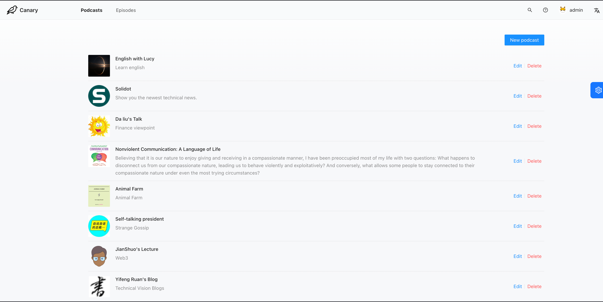

<h1 align="center" style="border-bottom: none">
    <b>
        <a href="https://github.com/PodcastIO/canary">Canary</a><br>
    </b>
    A tool to convert anything to podcast <br>
</h1>

<p align="center">
A tool to convert anything to podcast
</p>

<p align="center">
<a href=">https://discord.gg/HzW7S4PMjK"</a>
<a href="https://github.com/PodcastIO/canary"></a>
<a href="https://github.com/PodcastIO/canary"></a>
<a href="https://opensource.org/licenses/MIT"></a>

</p>

<p align="center">
    <a href="https://github.com/PodcastIO/canary"><b>Website</b></a> •
    <a href="https://discord.gg/HzW7S4PMjK"><b>Discord</b></a> •
    <a href="https://t.me/+1XGWY6uZKWw4NDE1"><b>Telegram</b></a>
</p>

<p align="center"></p>
<p align="center"></p>
<p align="center"></p>

## ✨ Features

- 🌈 Convert ebook, rss, videos to podcast.
- 💅 Pull rss, videos to convert podcast as time.
- 🚀 Support multiple languages, such as english, chinese, japanese, german, french, nertherlands, spanish.
- 🛡 Share podcast with rss. You can listen podcast by mobile.

## Need Help?

We are more than happy to help you. If you are getting some errors or problems while working with the project, or want to discuss something related to the project.

Just <a href="https://discord.gg/HzW7S4PMjK">Join Our Discord</a> server and ask for help.

## User Installation

### Requirements

1. Machine Configure.

- CPU: 8 Cores.
- Mem: 16 GB.
- Disk: 250 GB.

2. Docker

- [Install on Mac](https://docs.docker.com/desktop/install/mac-install/)

- [Install on Windows](https://docs.docker.com/desktop/install/windows-install/)

- [Install on linux](https://docs.docker.com/desktop/install/linux-install/)

## Deployment

1. clone canary source.

```bash
git clone https://github.com/PodcastIO/canary.git
```

2. set environments.

```bash
cd canary/docker
```
3. set .env, such mysql, redis, minio and email smtp for email login.
```
vim docker/.env
```

4. launch docker containers, if you prefer some language, you should add tts executors about the language.

```
bash docker/deploy.sh en en en zh
```

5. visite canary

```
http://[host]:10005
```

## Getting Started with development

Please view the [Document](./server/README.md) for backend development instructions and view the [Document](./web/README.md) for frontend development instructions.

## Roadmap

- [ ] re-generate single podcast or episode.
- [ ] edit episode chapter text.
- [ ] set regex rule to filter or modify chapter text.
- [ ] manage voice models.
- [ ] clone voice as some voice sample.

## Why Are We Building This?

When you were young, you had an appetite for knowledge. But now life is getting heavier and heavier，you shouldn't forget your appetite for knowledge. So we build it to keep your eyes free，you can listen any book, video, blog even though you are walking, running, driving、working.

## License

Distributed under the MIT License. See `LICENSE` for more information.

## Acknowledgements

Special thanks to these amazing projects which help power Canary:

- [ant design pro](https://github.com/ant-design/ant-design-pro)
- [rq](https://github.com/rq/rq)
- [ocrmypdf](https://github.com/ocrmypdf/OCRmyPDF)
- [you-get](https://github.com/soimort/you-get)
- [calibre](https://github.com/kovidgoyal/calibre)
- [fastapi](https://github.com/tiangolo/fastapi)
- [paddle speech](https://github.com/PaddlePaddle/PaddleSpeech)
- [coqui-ai/tts](https://github.com/coqui-ai/TTS)

## Legal Issues

This software is distributed under the [MIT license](https://raw.github.com/soimort/you-get/master/LICENSE.txt).

In particular, please be aware that

> THE SOFTWARE IS PROVIDED "AS IS", WITHOUT WARRANTY OF ANY KIND, EXPRESS OR
IMPLIED, INCLUDING BUT NOT LIMITED TO THE WARRANTIES OF MERCHANTABILITY,
FITNESS FOR A PARTICULAR PURPOSE AND NONINFRINGEMENT. IN NO EVENT SHALL THE
AUTHORS OR COPYRIGHT HOLDERS BE LIABLE FOR ANY CLAIM, DAMAGES OR OTHER
LIABILITY, WHETHER IN AN ACTION OF CONTRACT, TORT OR OTHERWISE, ARISING FROM,
OUT OF OR IN CONNECTION WITH THE SOFTWARE OR THE USE OR OTHER DEALINGS IN THE
SOFTWARE.

Translated to human words:

*In case your use of the software forms the basis of copyright infringement, or you use the software for any other illegal purposes, the authors cannot take any responsibility for you.*

We only ship the code here, and how you are going to use it is left to your own discretion.
